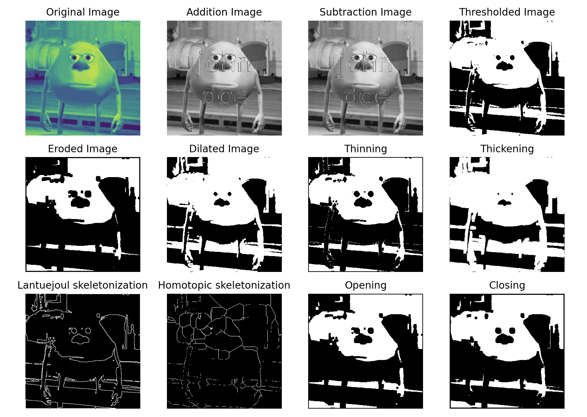

# Image Operations

This project provides a set of functions for performing various operations on images, such as addition, subtraction, thresholding, erosion, dilation, thinning, thickening, and skeletonization.

## Project Structure

The project is structured as follows:

- `image_operations/`: Contains the source code for the project.
  - `binary_operations.py`: Contains functions for binary operations on images.
  - `image_helper.py`: Contains helper functions for image processing.
  - `thinning.py`: Contains the function for thinning operation on images.
- `images/`: Contains the images used for testing.
- `main.py`: The main script that uses the functions from `image_operations/` to perform operations on images.

## Example Usage

